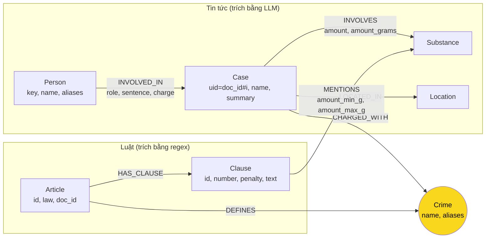

# Thiết kế Ontology — Day 19

**Họ tên:** Nguyễn Anh Trí  **MSSV:** 2A202602730

**Lựa chọn** (đánh dấu một):
- [ ] Dùng ontology gợi ý (có thể chỉnh nhỏ)
- [x] Tự thiết kế (xét bonus +15, xem `SUBMISSION.md`)

Thiết kế này bắt đầu từ ontology gợi ý và **thay đổi có chủ đích** ba điểm: khóa định danh ổn định,
chuẩn hóa tên chất đồng nghĩa, và mô hình hóa ngưỡng khối lượng. Phần 7 ghi rõ từng điểm khác.

## 1. Sơ đồ

Node cầu nối là **`Crime`** (màu vàng): luật `DEFINES` tội, tin `CHARGED_WITH` tội.

## 2. Entity types (node labels)

| Label | Ý nghĩa | Khóa định danh (`MERGE` theo) | Properties | Lấy từ KB nào | Trích bằng |
| --- | --- | --- | --- | --- | --- |
| `Article` | Một Điều luật | `id` (`"Điều 251 BLHS"`) | `title`, `law`, `doc_id` | Luật | regex |
| `Clause` | Một khoản trong Điều | `id` (`"Điều 251 BLHS khoản 1"`) | `number`, `penalty`, `text`, `doc_id` | Luật | regex |
| `Crime` | Tội danh (node cầu nối) | `name` (đã chuẩn hóa, bỏ "Tội ", lowercase) | `aliases` | cả hai | luật: tiêu đề Điều; tin: LLM + `link_entity` |
| `Case` | Một vụ việc trong bài báo | `uid = doc_id#i` (**không** dùng tên do LLM đặt) | `name`, `summary`, `date`, `source_title`, `doc_id` | Tin | LLM |
| `Person` | Người liên quan | `key` = tên viết thường, gộp khoảng trắng | `name`, `aliases` | Tin | LLM |
| `Substance` | Chất ma túy | `name` = tên chuẩn sau đồng nghĩa hóa | (không) | cả hai | luật: `find_substances`; tin: LLM + `canonical_substance` |
| `Location` | Địa điểm | `name` = tỉnh/thành đã chuẩn hóa | `label` | Tin | LLM |

## 3. Relationships

| Type | Từ → Đến | Properties trên cạnh | Ý nghĩa |
| --- | --- | --- | --- |
| `DEFINES` | Article → Crime | — | Điều luật định nghĩa tội danh |
| `HAS_CLAUSE` | Article → Clause | — | Điều có các khoản |
| `MENTIONS` | Clause → Substance | `amount_min_g`, `amount_max_g` | Khoản nhắc tới chất, kèm **ngưỡng khối lượng** (gram; `null` = không chặn trên) |
| `CHARGED_WITH` | Case → Crime | — | Vụ bị truy tố tội này |
| `INVOLVES` | Case → Substance | `amount` (chuỗi gốc), `amount_grams` (số) | Vụ liên quan chất, kèm khối lượng đã quy đổi |
| `LOCATED_IN` | Case → Location | — | Nơi xảy ra |
| `INVOLVED_IN` | Person → Case | `role`, `sentence`, `charge` | Vai trò, mức án, tội danh của người trong vụ |

## 4. Node cầu nối giữa 2 KB

- **Node nào:** `Crime` (tội danh).
- **Vì sao chọn node này:** tội danh là thứ **duy nhất** được nêu tường minh ở cả hai KB — luật đặt
  tên tội ở tiêu đề Điều, báo nêu tội danh của bị cáo. Chất chỉ là manh mối phụ (một Điều nhắc nhiều
  chất), còn số Điều thì tin tức hầu như không nêu. Vì vậy `Crime` cho đường đi ngắn và ổn định nhất.
- **Cách đảm bảo hai phía khớp tên:** hai lớp bảo vệ.
  1. Đưa **danh sách tên tội chuẩn** (lấy từ tiêu đề các Điều bằng regex) vào prompt trích xuất, yêu cầu
     LLM chọn nguyên văn.
  2. Dù vậy vẫn cho mọi charge qua `link_entity` (chuẩn hóa `normalize_crime`, khớp chính xác rồi
     `difflib` cutoff 0.8, trả về cách viết gốc trong luật).
- **Khi nào cầu gãy, và xử lý thế nào:** cầu gãy khi (a) `link_entity` trả `None` — tội trong báo
  không đủ giống bất kỳ tội nào trong luật; (b) LLM trích sai/không trích ra charge. Hiện xử lý: node `Case`
  vẫn được tạo nhưng **không có cạnh `CHARGED_WITH`**, nên nó nằm rời khỏi KB luật (đây chính là lỗi E1
  ở Bước 8.4, được phân tích trong `REPORT_KG.md`). Đề xuất: ghi lại charge thô vào `Case.raw_charges`
  để truy vết, và thêm bước đối chiếu thủ công khi `link_entity` thất bại.

## 5. Competency questions

| Câu | Đường đi (Cypher pattern) | Trả lời được? |
| --- | --- | --- |
| Q1 | `(:Article {law:'PCMT'})-[:HAS_CLAUSE]->(cl:Clause)` — lấy theo `doc_id` seed từ vector; đọc `cl.text` | Có (nhờ seed + 1 hop, không cần `Crime`) |
| Q2 | `(:Person)-[:INVOLVED_IN {sentence}]->(:Case)-[:INVOLVES]->(:Substance)` lọc `sentence CONTAINS 'tử hình'` | Có (mức án là property của quan hệ) |
| Q3 | `(:Person {name:'Lê Minh Thành'})-[:INVOLVED_IN]->(:Case)-[:CHARGED_WITH]->(:Crime)<-[:DEFINES]-(:Article {id:'Điều 251 BLHS'})-[:HAS_CLAUSE]->(:Clause)` | Có |
| Q4 | `(:Case)-[:CHARGED_WITH]->(:Crime)<-[:DEFINES]-(a:Article {id:'Điều 255 BLHS'})` + khoản cao nhất | Có (khung tối đa nằm trong `Clause.text`/`penalty`) |
| Q5 | `(:Case)-[:INVOLVES {amount_grams}]->(:Substance {name:'MDMA'})<-[:MENTIONS {amount_min_g, amount_max_g}]-(cl:Clause)<-[:HAS_CLAUSE]-(a:Article)` với `0.1<=...` chọn đúng khoản | Có — **đây là câu ontology gợi ý làm chưa chắc đúng**, xem Phần 7 |
| Q6 | `MATCH (k:Case)-[:INVOLVES]->(:Substance {name:'MDMA'}) RETURN k` | Có |

## 6. Quyết định thiết kế và đánh đổi

1. **Node cầu nối = `Crime` (không phải `Substance`).**
   Phương án khác: nối qua `Substance` vì chất có ở cả hai KB. Chọn `Crime` vì tội danh khớp 1-1 với
   Điều luật, còn một chất xuất hiện ở nhiều Điều (Điều 248–252 đều có MDMA) nên nối qua chất sẽ tạo
   đường đi mơ hồ. Đánh đổi: phụ thuộc vào chất lượng `link_entity` và prompt.

2. **`Case` khóa theo `uid = doc_id#i`, không theo tên LLM đặt.**
   Phương án khác: `MERGE (k:Case {name})` như gợi ý. Chọn `uid` vì tên do LLM sinh ra có thể trùng
   giữa hai bài (gộp nhầm hai vụ) hoặc khác nhau mỗi lần chạy (tách một vụ thành nhiều node). Đánh đổi:
   `name` chỉ còn là property, không dùng làm khóa; nhưng truy vấn theo tên vẫn chạy được.

3. **Ngưỡng khối lượng nằm trên cạnh `MENTIONS` và `INVOLVES`.**
   Phương án khác: để nguyên trong `Clause.text` rồi dựa vào việc vụ `INVOLVES` chất mà khoản `MENTIONS`
   chất để chọn khoản. Chọn mô hình hóa số vì cách kia kéo về **mọi** khoản nhắc chất đó (2,3,4) chứ
   không biết khoản nào khớp khối lượng thực tế. Đánh đổi: tốn thêm regex/parse, chỉ chính xác khi đơn vị
   và định dạng được nhận dạng.

4. **Kết cục (`role`, `sentence`, `charge`) đặt trên cạnh `INVOLVED_IN`.**
   Phương án khác: đặt trên node `Person`. Chọn trên cạnh vì cùng một người có thể có vai trò/mức án khác
   nhau ở các vụ khác nhau. Đánh đổi: trường rỗng khi báo không nêu (lỗi E6).

## 7. So với ontology gợi ý (bắt buộc nếu xét bonus)

| Điểm khác | Gợi ý làm gì | Bạn làm gì | Vấn đề nó giải quyết | Bằng chứng (Cypher, hoặc số liệu benchmark) |
| --- | --- | --- | --- | --- |
| Khóa `Case` | `MERGE (k:Case {name})` theo tên LLM | `MERGE (k:Case {uid: doc_id#i})` | Vụ trùng tên gộp nhầm / một vụ tách nhiều node (E3) | `MATCH (c:Case) RETURN c.uid, c.name` → mỗi `uid` ứng đúng 1 bài; không có 2 `uid` cùng `doc_id` |
| `Substance` đồng nghĩa | `MERGE (s:Substance {name})` theo tên LLM thô | `canonical_substance` + bảng đồng nghĩa (`ma túy kẹo`/`thuốc lắc`→`MDMA`, `heroin`→`Heroine`…) | Một chất thành nhiều node (E3) | `MATCH (s:Substance) RETURN s.name ORDER BY toLower(s.name)` → danh sách gọn, không còn biến thể hoa/thường |
| `Person` đồng nghĩa | `MERGE (p:Person {name})` | `MERGE (p:Person {key: plain_key(name)})` + `aliases` | Cùng người viết khác nhau thành nhiều node | `MATCH (p:Person) RETURN p.key, p.name` |
| Ngưỡng khối lượng | Không mô hình hóa; chỉ có `Clause.text` | `MENTIONS.amount_min_g/max_g`, `INVOLVES.amount_grams` | Q5 cần đúng **khoản** theo khối lượng, không chỉ đúng Điều | Cypher Phần 5/Q5 với `(k:Case)-[inv:INVOLVES]-(:Substance)<-[m:MENTIONS]-(cl)` và `inv.amount_grams >= m.amount_min_g` chỉ trả `Điều 250 BLHS - khoản 4` cho 9,6kg MDMA |

> Bằng chứng số trước/sau: chạy `KG_ONTOLOGY=hint python bench_kg.py --judge --out ket_qua_benchmark_kg.hint.txt`
> rồi `python bench_kg.py --judge` (mặc định custom) và dán 2 bảng vào `REPORT_KG.md`.

## 8. Hạn chế còn lại

- Ngưỡng parse bằng regex nên có thể sai khi luật dùng cách viết khác ("từ đủ", thể tích lỏng, "các chất
  ma túy khác"). Chỉ mô hình đúng các dòng có dạng `từ X đến dưới Y` / `X trở lên`.
- `Substance` vẫn có thể tạo node mới nếu LLM trả tên lạ không nằm trong danh sách chuẩn/đồng nghĩa.
- Không mô hình hóa giai đoạn tố tụng (bắt / khởi tố / xét xử / phúc thẩm): `Case.date` và `summary` chỉ
  giữ mức thô.
- Cầu nối vẫn gãy nếu `link_entity` thất bại; hiện chưa có cơ chế tự sửa, chỉ phát hiện được qua E1.
- Cùng một `Case` vẫn có thể bị tách nếu `build_graph` chạy lại trên cùng `doc_id` với `i` khác (do LLM
  trả số case khác nhau giữa các lần chạy) — nhưng mỗi lần benchmark đều `reset()` nên không tích lũy.
